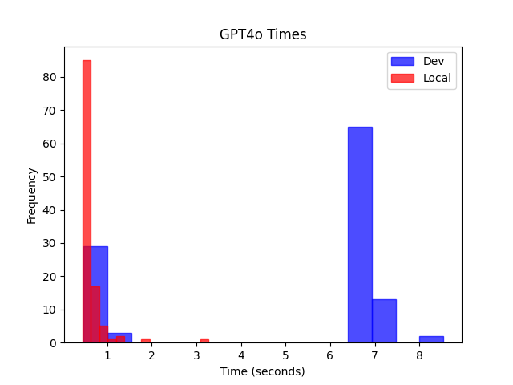
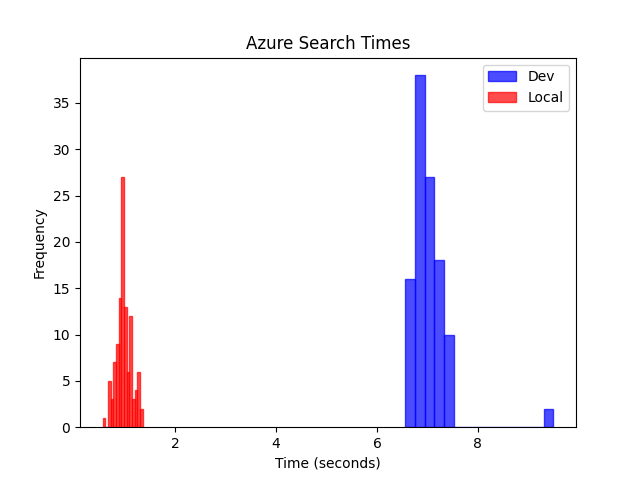
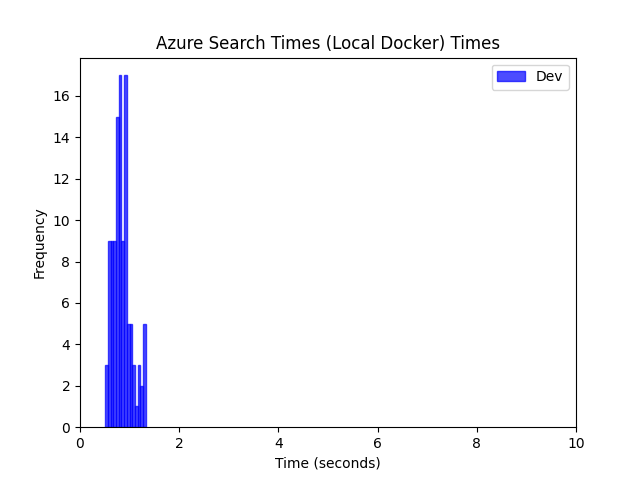
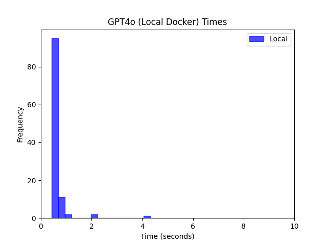
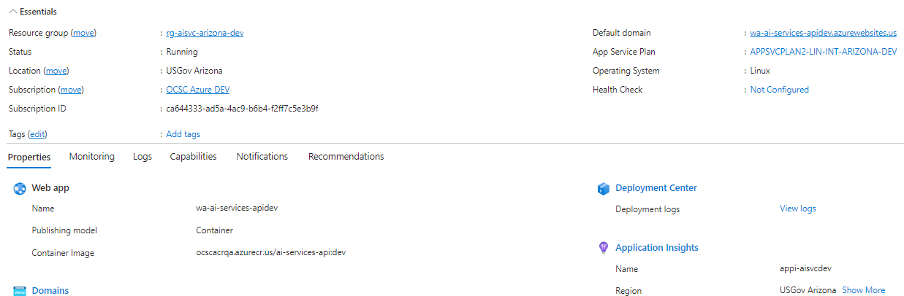
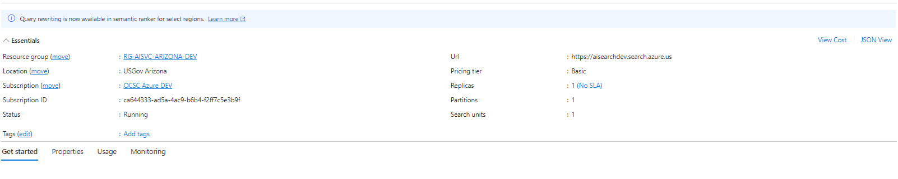
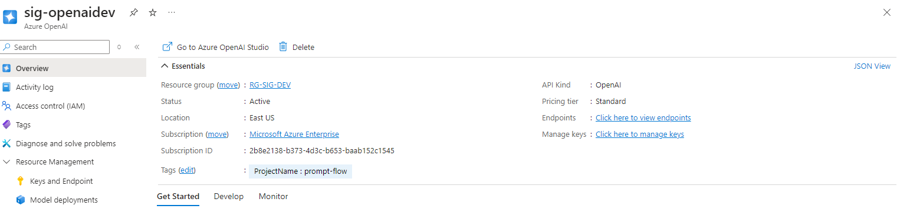

# Performance Comparison Between Dev Environment and Local Environment for Azure Services

## Introduction
This report presents an analysis of the time taken to invoke GPT-4 standard chat and Azure Search Vector Store on two different environments: the Dev Environment and the Local Environment. The objective of this analysis is to identify any significant performance differences between these environments based on the average response time, variability in performance (measured by standard deviation), and consistency (as indicated by median values). In addition, confidence intervals are included to quantify the certainty of these findings.

## Data Overview
Data was collected for two Azure services:
- **GPT-4o standard chat**
- **Azure Search Vector Store**

Each environment (Dev and Local) consists of 112 data points per service. The metrics evaluated include the **mean**, **standard deviation**, **variance**, and **median** response times. Additionally, confidence intervals for the mean response times were calculated to assess the statistical significance of the performance differences.

## Key Findings

### 1. GPT-4o Standard Chat Response Times

- **Dev Environment:**
  - Mean: 5.02 seconds
  - Standard Deviation: 2.72 seconds
  - Variance: 7.38
  - Median: 6.54 seconds
- **Local Environment:**
  - Mean: 0.64 seconds
  - Standard Deviation: 0.31 seconds
  - Variance: 0.10
  - Median: 0.56 seconds

#### Confidence Interval for Mean Response Time
- **Dev Environment**: The 95% confidence interval for the mean response time is **[4.58, 5.46]** seconds.
- **Local Environment**: The 95% confidence interval for the mean response time is **[0.55, 0.72]** seconds.

**Analysis**:  
The mean response time for GPT-4 in the Dev Environment (5.02 seconds) is significantly higher than in the Local Environment (0.64 seconds). This difference indicates that the Dev Environment takes, on average, over 7 times longer to return a response. Additionally, the standard deviation and variance in the Dev Environment are much higher, suggesting greater variability and inconsistency in the response times compared to the Local Environment.

- The **median response times** further confirm this trend, with the Dev Environment having a median of 6.54 seconds compared to 0.56 seconds in the Local Environment.

The 95% confidence intervals for the mean response times **do not overlap**, confirming that the Dev Environment is statistically slower than the Local Environment for GPT-4o standard chat.

### 2. Azure Search Vector Store Response Times

- **Dev Environment:**
  - Mean: 7.03 seconds
  - Standard Deviation: 0.40 seconds
  - Variance: 0.16
  - Median: 6.95 seconds
- **Local Environment:**
  - Mean: 0.98 seconds
  - Standard Deviation: 0.16 seconds
  - Variance: 0.02
  - Median: 0.96 seconds

#### Confidence Interval for Mean Response Time
- **Dev Environment**: The 95% confidence interval for the mean response time is **[6.83, 7.23]** seconds.
- **Local Environment**: The 95% confidence interval for the mean response time is **[0.92, 1.05]** seconds.

**Analysis**:  
Similarly to GPT-4, Azure Search in the Dev Environment shows a significantly higher mean response time (7.03 seconds) compared to the Local Environment (0.98 seconds). The standard deviation in the Dev Environment (0.40 seconds) is also slightly higher than in the Local Environment (0.16 seconds), indicating greater variability in response times. The variance values further support this conclusion.

- The **median response times** (6.95 seconds for Dev vs. 0.96 seconds for Local) also reflect a similar pattern of slower and more variable performance in the Dev Environment.

The 95% confidence intervals for the mean response times **do not overlap**, indicating that the Dev Environment is statistically slower than the Local Environment for Azure Search as well.

## Testing Docker Configuration Locally
The Dev Environment runs the API within a Docker container (`python:3.10-slim`). Containerization could introduce an additional layer of abstraction, which can add overhead in terms of resource usage, particularly when running in a cloud environment. This may lead to slower processing times compared to the Local Environment, where resources are used directly.

However, as part of our investigation into the performance issues, we tested the Azure services in a local Docker container to isolate whether Docker itself was contributing to the slowdown observed in the Dev Environment. By running the same Docker image locally, we aimed to rule out the possibility that Docker containerization was the cause of the performance discrepancy. However, the results below show that the endpoint response times remained fast locally, even within the Docker container. This indicates that Docker is not a contributing factor to the slower performance in the Dev Environment, and this has given us enough reason and evidence to exclude  containerization as the root cause of the issue.

- **GPT-4o:**
  - Mean: 0.62 seconds
  - Standard Deviation: 0.42 seconds
  - Variance: 0.18
  - Median: 0.52 seconds

- **Azure Search:**
  - Mean: 0.84 seconds
  - Standard Deviation: 0.18 seconds
  - Variance: 0.04
  - Median: 0.81 seconds

## Conclusion

The data indicates a significant performance discrepancy between the Dev Environment and the Local Environment, with both services (GPT-4 standard chat and Azure Search Vector Store) showing much slower response times in the Dev Environment compared to the Local Environment. The following points summarize the key conclusions:

- **Response Times**: Both GPT-4 and Azure Search take considerably longer in the Dev Environment, with mean response times approximately 7-8 times higher than in the Local Environment.
- **Variability**: The standard deviation and variance in the Dev Environment are much higher, indicating greater variability and inconsistency in performance.
- **Median Values**: The median response times further substantiate the slower performance in the Dev Environment compared to the Local Environment.
- **Confidence Intervals**: The 95% confidence intervals for the mean response times in both services **do not overlap**, providing strong statistical evidence that the observed differences in response times are significant.

Given these findings, it is clear that the Dev Environment is slower, and performance could be impacted by factors such as network latency or resource contention in the Dev Environment. Further investigation into the Dev Environment's configuration, and network conditions may help identify specific bottlenecks and areas for improvement.

## Current Infrastructure Configuration
The observed performance differences between the Dev and Local Environments can be partially attributed to the architecture and configuration of the Dev Environment:

1. **Cloud Deployment (Azure Web App)**:  
   The Dev Environment is deployed on an Azure Web App in Arizona. The physical location of the web app in Arizona may add network latency if the client is located far from this region. 
   

2. **Python & FastAPI Performance**:  
    Our backend uses Python 3.10 and FastAPI, both of which are performant technologies for building APIs. However, when running inside a Docker container, additional resource constraints might impact overall performance. 

3. **Azure Search Plan**:
    

4. **OpenAI Plan**:
   
